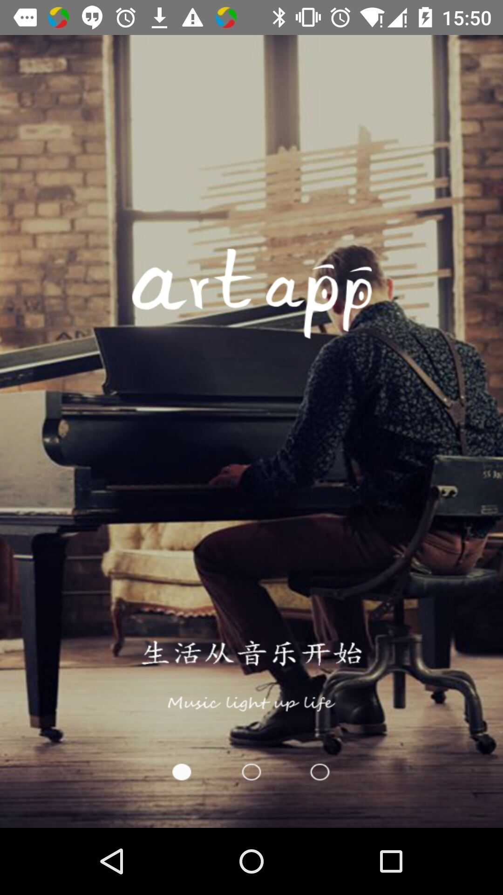
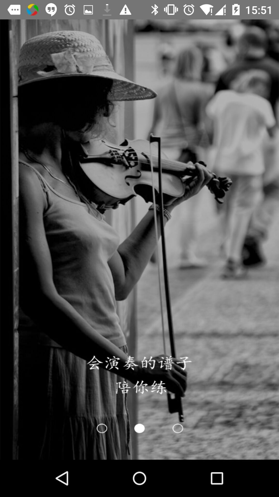
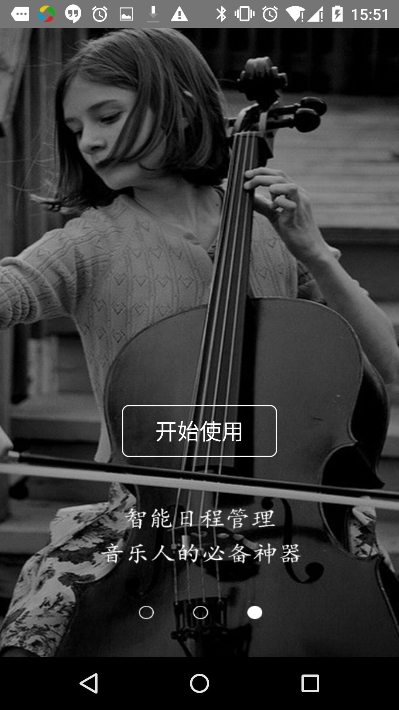
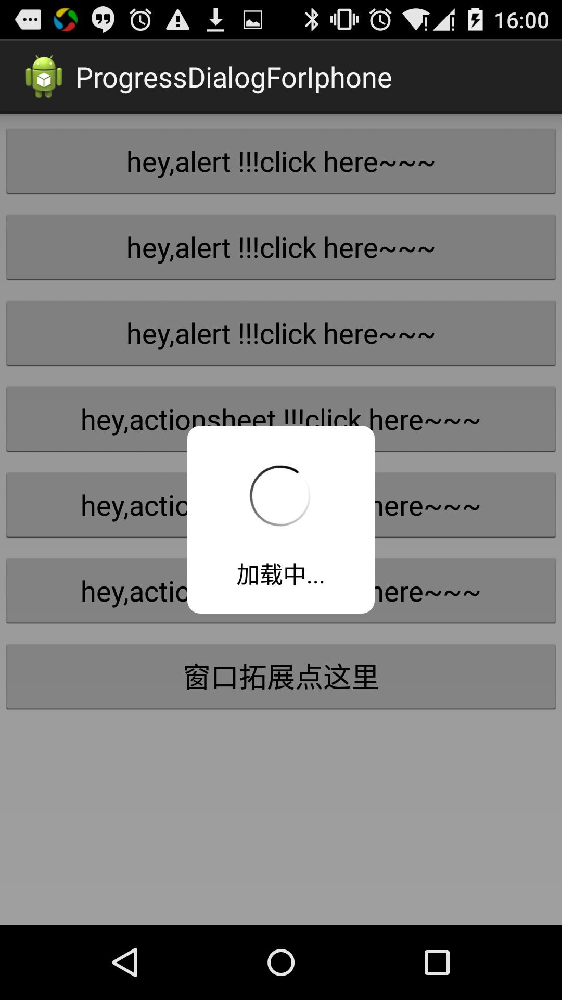
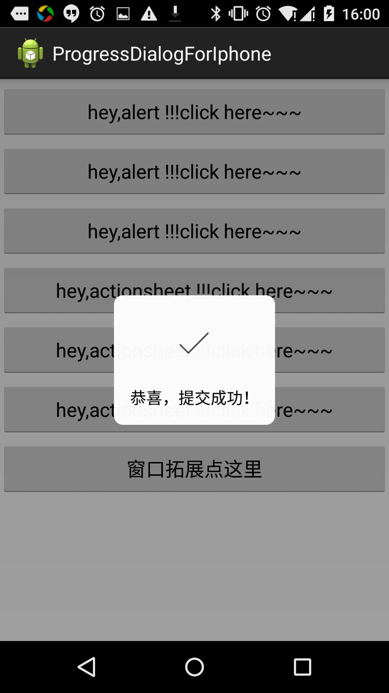
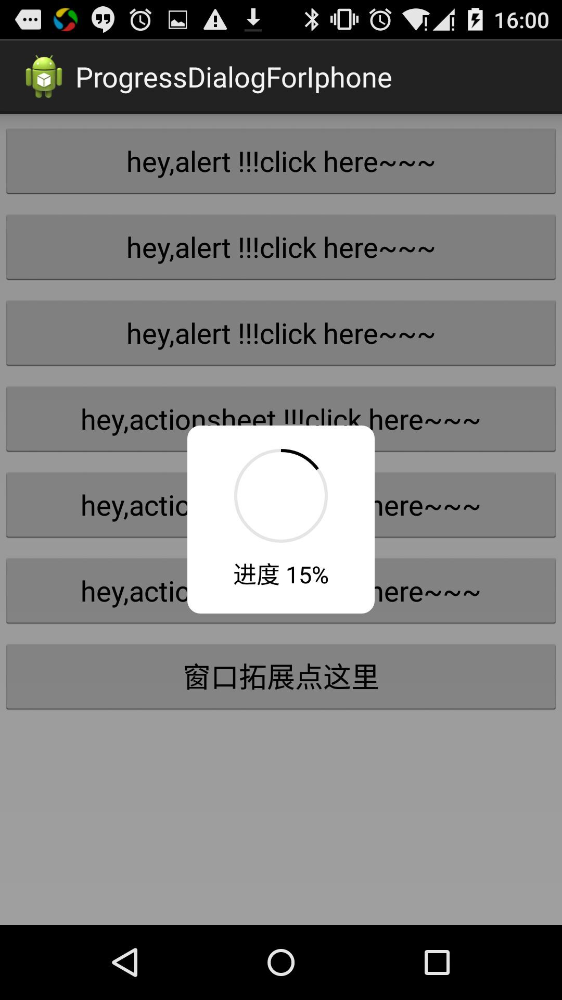

# AndroidLibrary

  This is a library for android development. There are many utils and samples to show how to 
  use them .Such as OkHttp ,Annoation ,Butterknif ,Fresco and GreenDAO ...
   

##首先来介绍下mylibrary库
这个库是我平时开发过程中整理出来的，对以后的快速开发有很大的帮助，也能大大提高自己开发水平和开发的熟练度。开发就是需要不断的总结，不断的开拓，这样才能不断的进步。


   
 

###Utils库

* FileHepler 管理文件路径-文件的常见操作
* FileCreatorHelper 文件创建帮助类，主要包括常见的jpg ，mp3,mp4文件的创建
* BitmapUtis Bitmap 操作类，jpg图片，drawable 转换成Bitmap ，bitmap压缩，计算，保存到scard卡中等。
* CheckUtis 主要是用户登录的一些验证，比如电话，有限，身份证，是否有特性字符
* DateUtis 主要包括Date Utc Calendar 的转换，格式化等。
* ImaegeLoaderUtis 用ImageLoader 加载各种URI。
* LG log统一管理类
* ListViewUtis 重写设置Listview 高度，解决scrollView嵌套不能完成显示的问题
* PhoneUtis 获取手机的一些信息
* SPutis sharedPreference 工具类
* ScreenUtis dp px sp 转换，屏幕分辨率等
* SdcardUtis sd卡管理
* T.java  Toast 管路
* StringUtils 字符串的常见操作。

### APP导航图的实现
####没有图我知道你们不会看,见上面


 具体实现：
 ```java
 public   class GuideActivity extends BaseActivity implements ViewPager.OnPageChangeListener {

    // 定义ViewPager对象
    private ViewPager viewPager;
    // 定义一个ArrayList来存放View
    private ArrayList<View> views;
    // 定义各个界面View对象
    private View view1, view2, view3;
    // 定义开始按钮对象
    private Button btnStart;

    @Override
    protected void onCreate(Bundle savedInstanceState) {
        super.onCreate(savedInstanceState);
        requestWindowFeature(Window.FEATURE_NO_TITLE);
        setContentView(R.layout.activity_guide);
        initView();
    }

    /**
     * 初始化
     */
    private void initView() {
        // 实例化ViewPager
        viewPager = (ViewPager) findViewById(R.id.viewpager);

        // 实例化各个界面的布局对象
        LayoutInflater mLi = LayoutInflater.from(this);
        view1 = mLi.inflate(R.layout.guide_view1, null);
        view2 = mLi.inflate(R.layout.guide_view2, null);
        view3 = mLi.inflate(R.layout.guide_view3, null);
        //	view4 = mLi.inflate(R.layout.guide_view4, null);
        // 实例化ArrayList对象
        views = new ArrayList<View>();
        // 将要分页显示的View装入数组中
        views.add(view1);
        views.add(view2);
        views.add(view3);
        //	views.add(view4);

        // 设置监听
        viewPager.setOnPageChangeListener(this);
        // 设置适配器数据
        viewPager.setAdapter(new ViewPagerAdapter(views));

        // 实例化开始按钮
        btnStart = (Button) view3.findViewById(R.id.startBtn);
        // 给开始按钮设置监听
        btnStart.setOnClickListener(new View.OnClickListener() {
            @Override
            public void onClick(View v) {
                SPUtils.put(GuideActivity.this, Constant.GUIDE_NAME,Constant.GUIDE_VERSION);
                // SplashActivity.sp.edit()
                //        .putInt("VERSION", SplashActivity.VERSION).commit();
                //startActivity(new Intent(GuideActivity.this, LoginActivity.class));
                // finish();
                toLoginActivity();
                finish();

            }

        });
    }

    /**
     *
     */
    public   void  toLoginActivity(){

    }


    /**
     * 滑动状态改变时调用
     */
    @Override
    public void onPageScrollStateChanged(int arg0) {

    }

    /**
     * 当前页面滑动时调用
     */
    @Override
    public void onPageScrolled(int arg0, float arg1, int arg2) {

    }

    /**
     * 新的页面被选中时调用
     */
    @Override
    public void onPageSelected(int arg0) {
    }

}
 
 
 //自己实现下就ok了。
 
 ```
 
 
 

### 版本更新提示，
    实现思路：
    根据mainfiest 的版本号，和根据服务器获取的版本号不一致时，提示更新。

    代买在update 包下：
    使用方法：
```java 

//出现对话框提示更新
new VersionCheck(this).startCheckVersion(1);
//出先Toast 提示更新
new VersionCheck(this).startCheckVersion(1);

```
具体代码都比较简单了，自己看。

###记载提示框 SvpProgressDialog 
这个框架是在贴吧看到了，具体作者已经记不清，感谢原作者
####上图了

   


      使用方法:
      自行拷文件,
      
      具体使用：
      
```java
public class MainActivity extends Activity {
	int progress = 0;
	@Override
	protected void onCreate(Bundle savedInstanceState) {
		super.onCreate(savedInstanceState);
		setContentView(R.layout.activity_main);
	}

	public void alertShow1(View view){
		SVProgressHUD.show(this);
	}
	public void alertShow2(View view){
		SVProgressHUD.showWithMaskType(this, SVProgressHUD.SVProgressHUDMaskType.None);
		//	        SVProgressHUD.showWithMaskType(this,SVProgressHUD.SVProgressHUDMaskType.Black);
		//	        SVProgressHUD.showWithMaskType(this, SVProgressHUD.SVProgressHUDMaskType.BlackCancel);
		//	        SVProgressHUD.showWithMaskType(this, SVProgressHUD.SVProgressHUDMaskType.Clear);
		//	        SVProgressHUD.showWithMaskType(this, SVProgressHUD.SVProgressHUDMaskType.ClearCancel);
		//	        SVProgressHUD.showWithMaskType(this, SVProgressHUD.SVProgressHUDMaskType.Gradient);
		//	        SVProgressHUD.showWithMaskType(this, SVProgressHUD.SVProgressHUDMaskType.GradientCancel);
	}
	public void alertShow3(View view){
		SVProgressHUD.showWithStatus(this, "加载中...");
	}
	public void alertShow4(View view){
		SVProgressHUD.showInfoWithStatus(this, "这是提示", SVProgressHUD.SVProgressHUDMaskType.None);
	}
	public void alertShow5(View view){
		SVProgressHUD.showSuccessWithStatus(this, "恭喜，提交成功！");
	}
	public void alertShow6(View view){
		SVProgressHUD.showErrorWithStatus(this, "不约，叔叔我们不约～", SVProgressHUD.SVProgressHUDMaskType.GradientCancel);
	}
	Handler mHandler = new Handler(){
		@Override
		public void handleMessage(Message msg) {
			super.handleMessage(msg);
			progress = progress + 5;
			if (SVProgressHUD.getProgressBar(MainActivity.this).getMax() != SVProgressHUD.getProgressBar(MainActivity.this).getProgress()) {
				SVProgressHUD.getProgressBar(MainActivity.this).setProgress(progress);
				SVProgressHUD.setText(MainActivity.this, "进度 "+progress+"%");

				mHandler.sendEmptyMessageDelayed(0,500);
			}
			else{
				SVProgressHUD.dismiss(MainActivity.this);
				SVProgressHUD.getProgressBar(MainActivity.this).setProgress(0);
			}

		}
	};
	public void alertShowExt(View view){
		SVProgressHUD.showWithProgress(this, "进度 "+progress+"%", SVProgressHUD.SVProgressHUDMaskType.Black);
		progress = 0;
		mHandler.sendEmptyMessageDelayed(0,500);
	}

	@Override
	public boolean onKeyDown(int keyCode, KeyEvent event)
	{
		if (keyCode == KeyEvent.KEYCODE_BACK && event.getRepeatCount() == 0)
		{
			if(SVProgressHUD.isShowing(this)){
				SVProgressHUD.dismiss(this);
				return false;
			}
		}

		return super.onKeyDown(keyCode, event);

	}
}


//再次感谢原作者。
```

###意见销毁所以Acitivity

这个应该是每个应用都需要的，直接上代码了。

这是收集Activity的容器
```java
public class ActivityCollector {


    private static Stack<Activity> activityStack;
    private static ActivityCollector instance;
    private ActivityCollector() {

    }

    /**
     * 单一实例
     */
    public static ActivityCollector getInstance() {
        if (instance == null) {
            instance = new ActivityCollector();
        }
        return instance;
    }

    /**
     * 添加Activity到堆栈
     */
    public void addActivity(Activity activity) {
        if (activityStack == null) {
            activityStack = new Stack<Activity>();
        }
        activityStack.add(activity);
    }


    public void removeActivity(Activity activity) {
        if (activityStack == null) {
            activityStack = new Stack<Activity>();
        }
        activityStack.remove(activity);
    }
    
   /**
     * 结束所有Activity
     */
    public void finishAllActivity() {
        for (Activity activity : activityStack) {
            if (!activity.isFinishing()) {
                activity.finish();
            }
        }
        //activityStack.clear();
    }
    
    
     /**
     * 退出应用程序
     */
    public void AppExit(Context context) {
        try {
            finishAllActivity();
            // 杀死该应用进程
            android.os.Process.killProcess(android.os.Process.myPid());
            System.exit(0);
        } catch (Exception e) {
        }
    }
```
需要一个BaseActivity 

```java

public class BaseFragmentActivity extends FragmentActivity {


    private static final String TAG="lifescycle";
    @Override
    protected void onCreate(Bundle savedInstanceState) {
        super.onCreate(savedInstanceState);
        //去除系统标题
      //  this.requestWindowFeature(Window.FEATURE_NO_TITLE);
      //  Log.d(TAG, "BaseActivity onCreate Invoke...");
        ActivityCollector.getInstance().addActivity(this);

    }
    @Override
    protected void onStart() {
        super.onStart();
       // Log.d(TAG, "BaseActivity onStart Invoke...");
    }
    @Override
    protected void onRestart() {
        super.onRestart();
      //  Log.d(TAG, "BaseActivity onRestart Invoke...");
    }
    @Override
    protected void onResume() {
        super.onResume();
        Log.d(TAG, "BaseActivity onResume Invoke...");
    }

    @Override
    protected void onPause() {
        super.onPause();
      //  Log.d(TAG, "BaseActivity onPause Invoke...");
    }

    @Override
    protected void onStop() {
        super.onStop();
      //  Log.d(TAG, "BaseActivity onStop Invoke...");
    }

    @Override
    protected void onDestroy() {
        super.onDestroy();
        ActivityCollector.getInstance().removeActivity(this);
    }

    @Override
    public void onLowMemory() {
        super.onLowMemory();
      //  Log.d(TAG, "BaseActivity onLowMemory Invoke...");
    }

    @Override
    public void onBackPressed() {
        super.onBackPressed();
     //   Log.d(TAG, "BaseActivity onBackPressed Invoke...");
        ActivityCollector.getInstance().finishActivity();
    }

}

```

###
    


